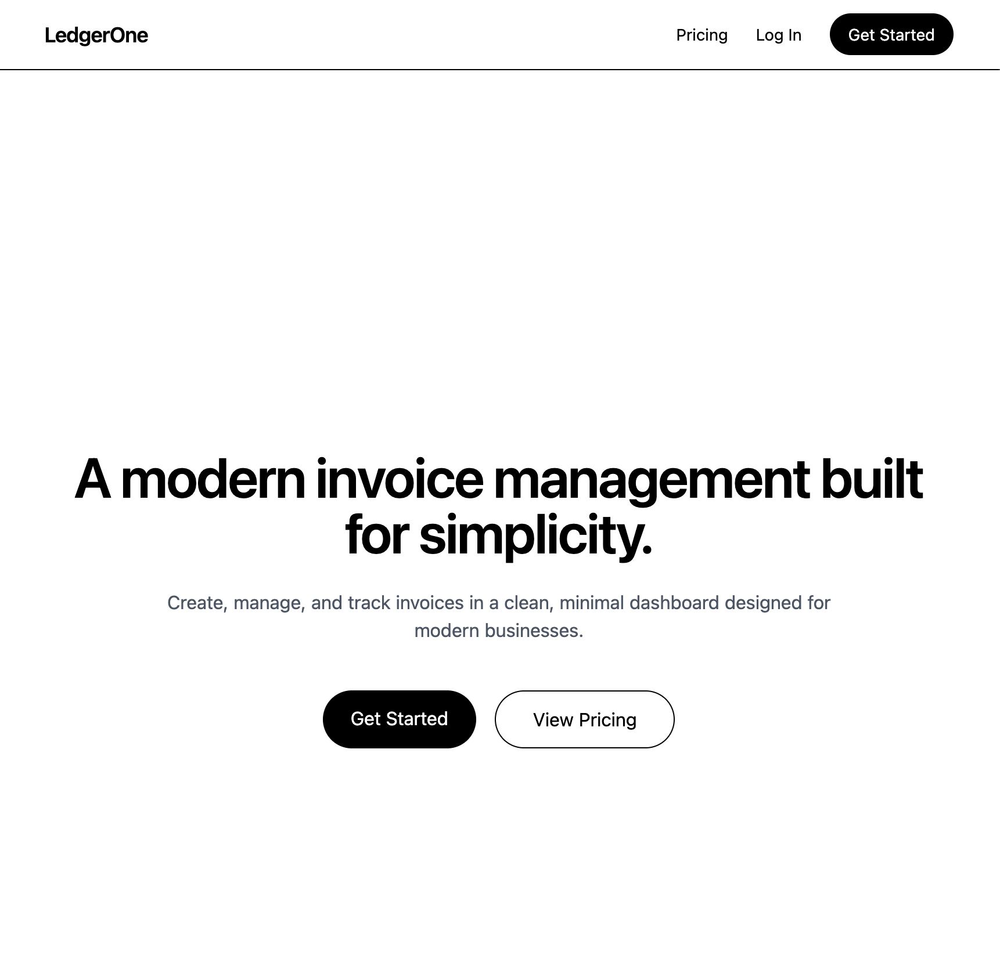

# Daniel Seog — Portfolio

🔗 **Live Site:** https://danieljseog.vercel.app/

---

## 👋 About

This is my personal portfolio website showcasing my work as a frontend developer.  
I focus on building modern, scalable web applications with clean UI, intuitive UX, and real-world impact.

---

## ✨ Features

- Full-width animated hero section with cinematic background
- Responsive layout optimized for desktop and mobile
- Interactive project showcase with image carousel
- Clean, modern UI with subtle animations
- Smooth transitions powered by Framer Motion
- Continuous deployment with Vercel

---

## 🛠 Tech Stack

**Frontend**
- Next.js (App Router)
- React
- TypeScript
- Tailwind CSS

**Animations**
- Framer Motion

**Backend / Data**
- Supabase (Authentication & Database)

**Deployment**
- Vercel

---

## 📸 Preview



---

## 🚀 Getting Started

Clone the repository:

```bash
git clone https://github.com/itzjunghwun/portfolio-site.git
cd portfolio-site

Install dependencies:

npm install

Run the development server:

npm run dev

Open in browser:

http://localhost:3000

app/                # Next.js App Router pages
components/         # Reusable UI components
public/images/      # Static assets (images)

What I Learned

Designing clean, production-level user interfaces

Structuring scalable applications using Next.js

Creating smooth animations with Framer Motion

Building and deploying full-stack apps with Supabase and Vercel

Improving user experience through layout, motion, and responsiveness

What I Learned

Designing clean, production-level user interfaces

Structuring scalable applications using Next.js

Creating smooth animations with Framer Motion

Building and deploying full-stack apps with Supabase and Vercel

Improving user experience through layout, motion, and responsiveness
